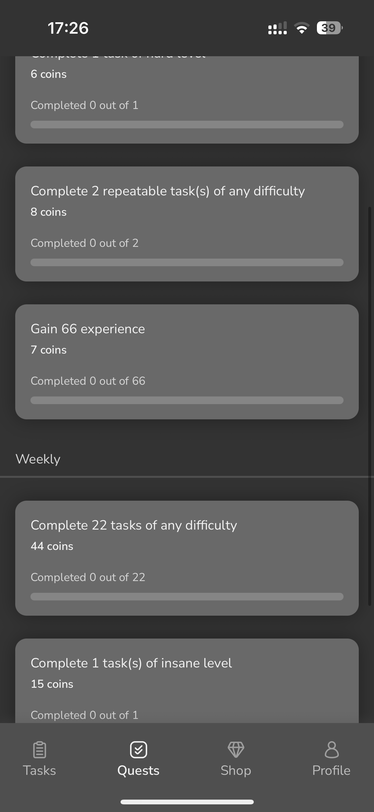

# Levelyst

## Overview

Basically it's a task manager for those who like gamified elements on mobile application. It provides users with both essentail to-do features like creating and marking tasks and gamification, such as daily and weekly quests. Users get coins for completing quests that can be spent in the shop. 

## Features

- Creating, viewing and marking both single-time and repeatable tasks
- Setting difficulty level and adding badges to tasks
- Daily and weekly quests that gives coins when completed
- Shop where user can spend coins 
- Miltiple app color themes that can be bought in shop
- Profile with weekly statistics of user

## Technologies used

- React Native
- Expo 
- Async Storage
- React Native Reanimated
- Expo SQLite
- Typescript

## Screenshots

<table>
  <tr>
    <td></td>
    <td></td>
    <td></td>
    <td></td>
  </tr>
  <tr>
    <td></td>
    <td></td>
    <td></td>
    <td></td>
  </tr>
</table>